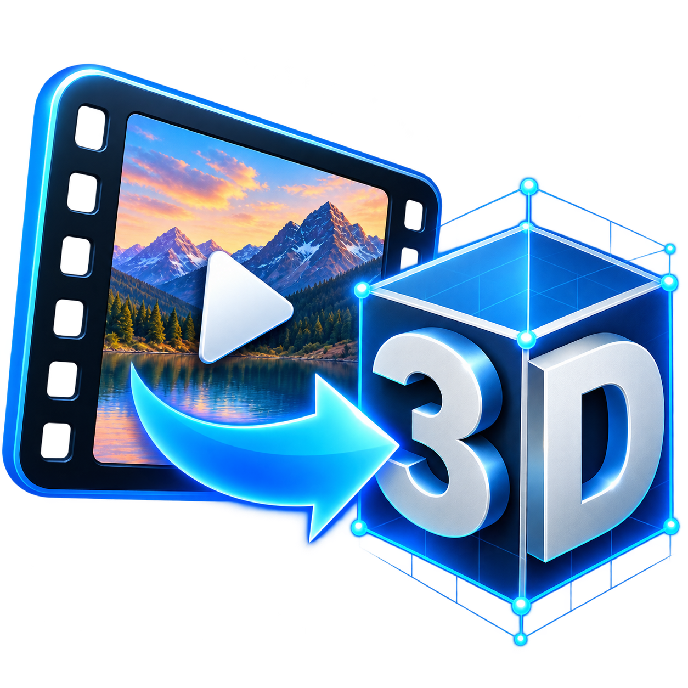
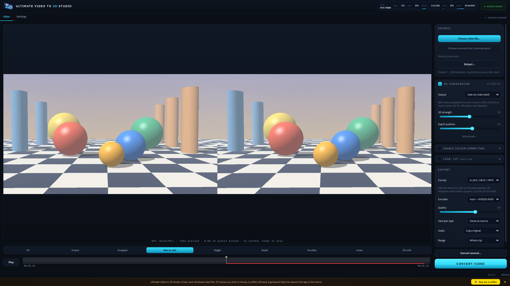
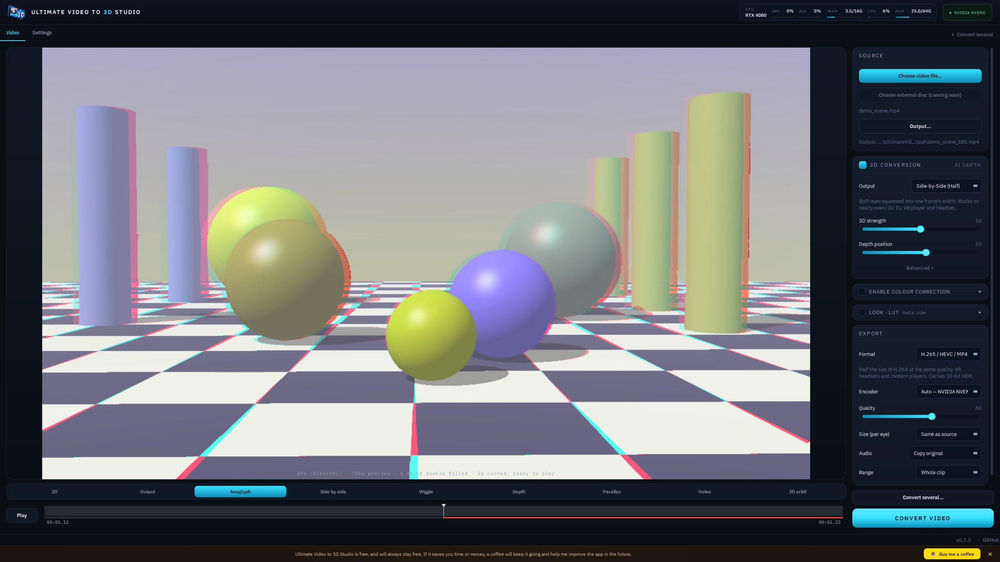
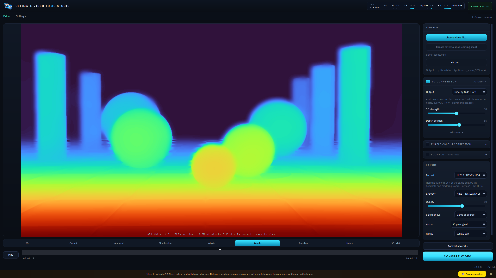
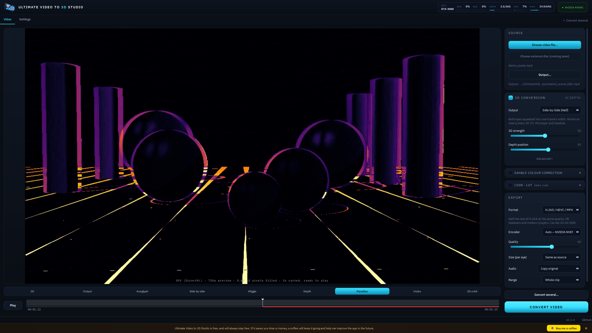
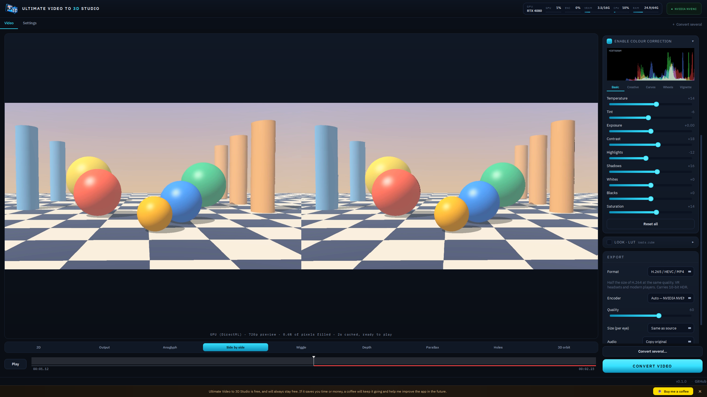
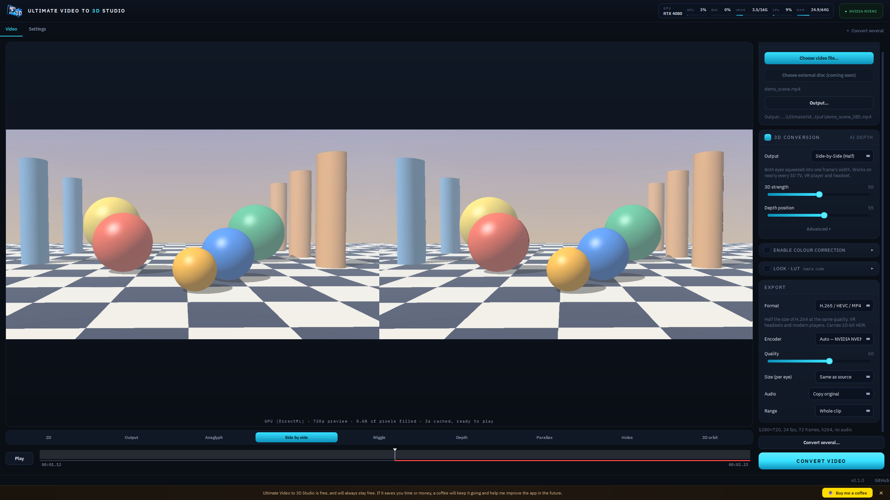
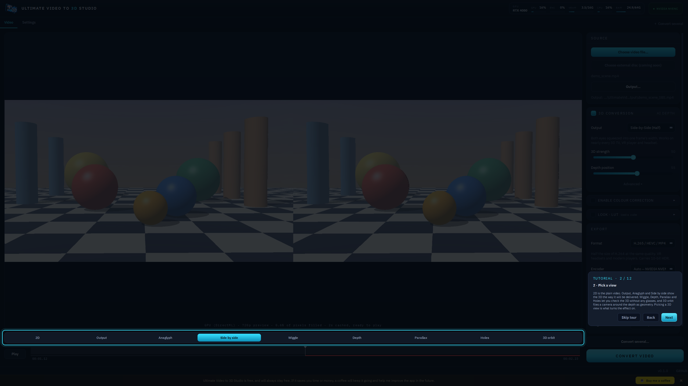

<div align="center">



# Ultimate Video to 3D Studio

**Turn any flat video into stereoscopic 3D with AI depth. Free, on any GPU, no CUDA.**

Side-by-Side · Top-and-Bottom · Anaglyph · Colour + Depth, for VR headsets, 3D TVs, projectors and red/cyan glasses.

[](https://github.com/criso2hd-alt/Ultimate-Video-to-3D-Studio/releases/latest)
[](https://discord.gg/mEfSW3XfNn)
[](#download)
[](#how-it-works)
[](LICENSE)
[](https://buymeacoffee.com/criso2hdj)

<a href="docs/screenshots/hero-side-by-side.png"></a>

<sub>The real app at 2560 × 1440, on a demo scene rendered for this project. Click any picture to see it full size.</sub>

[Download](#download) · [Screenshots](#screenshots) · [Features](#what-it-does) · [How it works](#how-it-works) · [Community](#community) · [Roadmap](#planned)

</div>

---

> ☕ **It is free, and it will stay free.** If it saves you time or money, a coffee keeps it going and helps me
> improve it. There is a button in the app and one above.

## Download

Get the latest **Windows 64-bit** zip from the
[Releases page](https://github.com/criso2hd-alt/Ultimate-Video-to-3D-Studio/releases/latest), unzip it
anywhere, and run `UltimateVideo3DStudio.exe`. It is portable: everything it saves (settings, models
folder, output, LUTs) stays in that folder. The first launch downloads the video component (~35 MB) and
tests which video encoders your graphics card can use; a short tutorial follows.

Windows may show a *SmartScreen* warning because the app is not code-signed yet: choose **More info →
Run anyway**. (Only download it from this repository's Releases page.)

Requires Windows 11 (64-bit) and a DirectX 12 graphics card. **macOS is coming in 0.2.**

## Screenshots

Real screenshots of the app, taken at **2560 × 1440**. The footage is a scene generated for this project
(`scripts/make_demo_scene.py`), so the depth is easy to see.

| The 3D views: anaglyph (red/cyan glasses) | The depth map the AI estimates |
| :---: | :---: |
| [](docs/screenshots/anaglyph.png) | [](docs/screenshots/depth-map.png) |

| Parallax: how far each pixel moves between the eyes | Professional colour correction, with scopes |
| :---: | :---: |
| [](docs/screenshots/parallax.png) | [](docs/screenshots/colour-correction.png) |

| Every codec, with your GPU's encoder picked for you | A guided tutorial on first launch |
| :---: | :---: |
| [](docs/screenshots/export.png) | [](docs/screenshots/tutorial.png) |

## What it does

- **2D → 3D with real depth.** Depth Anything V2, made steady over time (no
  pumping or shimmer), edge-aligned to the picture (no halos), and rendered with a
  z-buffered forward warp that fills gaps from the *background* side.
- **Outputs:** Side-by-Side (half / full), Top-and-Bottom (half / full), red-cyan
  Anaglyph, Colour + Depth (2D+Z), or a depth-map video.
- **Live preview on a small proxy (540p by default, up to 720p),** running the same
  maths as the export. It opens **paused on the plain video**; a permanent bar under the
  picture switches between **2D** and the 3D views. Pick a 3D view and, while the video is
  paused, the app **keeps rendering ahead into a cache folder on disk** (the red bar under the
  timeline shows how far), so pressing Play starts at once. While it plays it stays 5–10
  seconds ahead, so playback stays smooth (it pauses briefly to "Buffer" instead of
  stuttering). Click anywhere on the picture to play or pause. Views:
  - *Anaglyph, Side by side, Output* — see it the way it will be delivered.
  - *Wiggle, Depth, Parallax, Holes, 3D orbit* — check the 3D **without glasses**:
    alternate the two eyes, view the depth map, see how far each pixel moves, see
    where the renderer had to invent picture, or fly a camera around the depth as
    a point cloud.
- **A short guided tutorial** on first launch (welcome, then each control lit in turn, with the side panel
  scrolling to it); replay it any time from Settings > Help.
- **Professional colour correction**, one collapsible card: temperature, tint,
  exposure, contrast, highlights, shadows, whites, blacks, saturation · faded
  film, sharpen, vibrance · RGB curves · shadows/midtones/highlights colour
  wheels · vignette · histogram / waveform / vectorscope. Runs live.
- **LUTs:** load any `.cube` (3D or 1D), with intensity, before or after the grade.
- **HDR kept intact.** HDR10 (PQ) and HLG sources stay 10-bit with BT.2020 tags
  through to the output, or convert cleanly to SDR.
- **Every codec:** H.264, H.265/HEVC, AV1, VP9, ProRes, DNxHR, FFV1 lossless.
- **Uses your GPU's video encoder** (NVENC / AMF / Quick Sync / VideoToolbox) —
  detected once at first launch and saved — with a CPU encoder as the safety net.
- Timeline with In/Out range, audio carried across (trimmed to the range),
  batch queue, live GPU / encoder / VRAM / CPU / RAM gauge.

## How it works

```
decode → grade → depth (ONNX, on your GPU) → edge-refine → stereo warp → pack → encode → audio
```

| Stage | Runs on | Why |
| ----- | ------- | --- |
| Depth model | GPU via ONNX Runtime: **DirectML** (any DX12 GPU) on Windows, **CoreML** on Mac | vendor-neutral; no CUDA/cuDNN download |
| Stereo warp, colour grade, tone map | CPU, all cores (Numba) | one implementation for Intel, AMD and Apple silicon |
| Video encode | your GPU's fixed-function encoder | nearly free; frees the CPU |

An encoder is trusted only after it has really been opened and fed a frame at the
output size, so a card that *lists* NVENC but cannot use it falls back cleanly.

Measured here (RTX 4080, 1620×1080 source → half-SBS H.265, hardware encode):
~16 fps end to end; depth 21 ms/frame and warp 9 ms/frame at 720p.

## Community

**[Join the Discord](https://discord.gg/mEfSW3XfNn)** to ask questions, share your conversions, report
problems and tell me what to build next. Bug reports on [GitHub Issues](https://github.com/criso2hd-alt/Ultimate-Video-to-3D-Studio/issues)
help too — run `python main.py --selftest` (or send a screenshot of Settings) so I can see your GPU and
encoders.

If the app earns a place in your workflow, [buying me a coffee](https://buymeacoffee.com/criso2hdj) is what
keeps it free for everyone.

## Run from source

Windows:

```powershell
.\scripts\setup.ps1      # Python 3.12 venv and dependencies
.\scripts\run.ps1        # the depth model and video component download themselves on first run
```

macOS (untested until 0.2):

```bash
./scripts/setup.sh
./scripts/run.sh
```

`python main.py --selftest` prints your GPU, which encoders work, and depth/warp
timings — paste it into a bug report.

## Build

```powershell
.\scripts\build_release.ps1     # release\UltimateVideo3DStudio\  (portable folder)
```

```bash
./scripts/build_mac.sh          # release/Ultimate Video to 3D Studio.app (unsigned)
```

The video component (FFmpeg via PyAV, ~35 MB) is downloaded the first time it is
needed, not bundled. The depth model (Apache-2.0 Depth Anything V2 Small, fp16,
50 MB) ships in the release zip; if it is ever missing, the app downloads it from this
repository's `models-v1` release by itself.

## Updates

At launch the app asks GitHub for the newest published release and compares it with its own
version. If there is a newer one, an **UPDATE · vX.Y.Z** button appears at the top with a link
to the download page. That is all: nothing is downloaded or installed automatically. It can
be turned off (or run on demand) in Settings → Updates. It sends one anonymous request to
`api.github.com` and does nothing at all if it cannot reach it.

## Tests

```
python -m pytest        # ~130 tests, about a minute, no GPU or model needed
```

## Status and known gaps

Working and tested on Windows 11 (NVIDIA + DirectML): everything above.

Not yet done / not yet verified — stated plainly:

- **macOS is written but untested**, and is not part of 0.1: CoreML depth, VideoToolbox
  encoding, GPU readout via `ioreg`, the `.app` build. It will be tested on an Apple Silicon
  MacBook Pro and released with 0.2.
- **AMD (AMF) and Intel (Quick Sync) encoders** are in the ladder and the FFmpeg
  build includes them, but have only been exercised on NVIDIA hardware.
- The live preview of an **HDR source** is tone-mapped to SDR for the screen; exports keep
  the HDR (10-bit, PQ/HLG tags).
- 3D quality: edges are hard-splatted (a little aliasing at very high strength);
  no floating window yet; disocclusions are filled by mirroring the background,
  not by AI inpainting.
- Spatial-video containers (MV-HEVC for Apple Vision Pro) and VR180 are not done.

## Planned

- **Version 0.2: macOS, and your own discs.** A Mac build tested on real hardware, and a
  "Choose external disc" source: copy a DVD or Blu-ray you own to a file on disk first (as fast as
  the drive allows), then convert that. Movie-length conversions will get pause and resume.
- **VR headset preview and player (OpenXR).** With any OpenXR headset connected
  (Meta Quest via Link/Air Link, SteamVR, Virtual Desktop, WMR…), put it on and see the
  converted video on a large virtual screen: move and resize the screen, with the stereo
  layout (side-by-side, top-and-bottom, full/half) applied automatically from the chosen
  output, plus a basic player (play/pause, seek, volume) driven by the controllers.
  Later: selectable environments/backgrounds.

## Layout

```
ultimate_video_3d/    the app        (see CLAUDE.md for a map)
tests/                pytest + screenshot harnesses
scripts/              setup / run / build for Windows and macOS, and the demo-scene generator
docs/screenshots/     the pictures on this page
icon/                 app icons
```

## Licence

**Source-available, not open source.** See [LICENSE](LICENSE).

Free to use, personally or commercially. The source is here so you can read it,
audit it, and build it yourself. Please do not redistribute it — no mirrors,
reuploads, repacks or packaged builds — do not sell it or put it behind a
paywall, and do not use the code in another product. Send people to this
repository instead.

Third-party components keep their own licences (the bundled Depth Anything V2
Small model is Apache-2.0; the larger Base/Large models are CC-BY-NC and are
not included; the bundled IBM Plex and Archivo fonts are under the SIL Open Font
License 1.1, in `ultimate_video_3d/assets/fonts/OFL.txt`).
